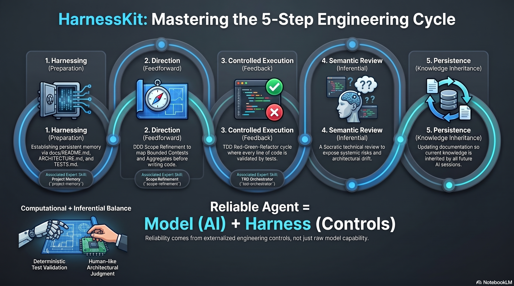
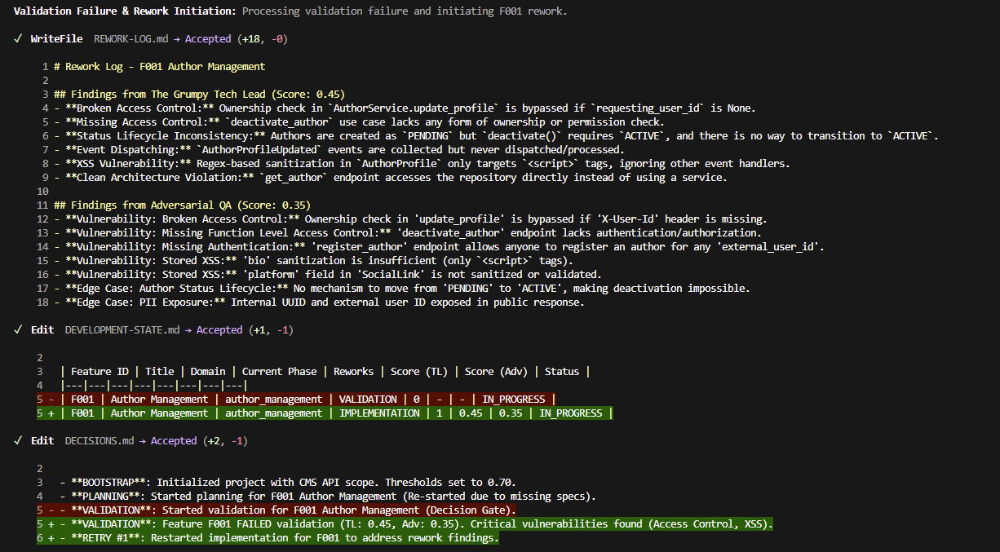
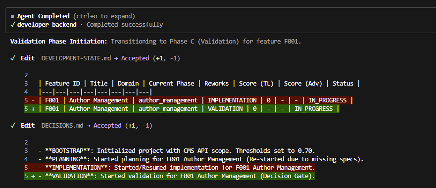

> **vgr-kit** — merged for the VGR (Vigilância e Recompensa) mobile app, built from scratch.
> Base engine: harness-kit 1.3.2 (full SDK/orchestrator/agents/skills below, `.git` history dropped).
> Added from engine-kit 0.3.0: skills `git-setup`, `git-commit-push`, `git-push`, `git-security`, `decision-rounds`, `retain-knowledge`.
> Left out (dormant — legacy-analysis tooling, not needed for a greenfield build): `legacy-analyst` agent, skills `assess-legacy-repo`, `conceptual-guardian`, `scope-census`. Revisit these only if VGR ever needs to absorb/replace an existing system.

# 🔧 HarnessKit



> **Harness Engineering**: A reliable AI agent is not just a raw model. It is defined as:
> $$\text{Reliable Agent} = \text{Model (AI)} + \text{Harness (Controls)} + \text{Human Auditor}$$

HarnessKit is a complete AI-assisted software engineering methodology built on **Harness Engineering**—the principle that true reliability comes from enclosing generative models inside structured execution scaffolds and human-driven governance loops.

---

## 👑 The Core Engine: Autonomous Orchestration & Live Auditing

At the heart of HarnessKit is the **`autonomous-orchestrator`** skill. Once provided with the initial task scope, it runs an atomic, continuous execution cycle without stopping, pausing, or asking redundant questions—fully automating domain planning, TDD execution, and multi-agent code reviews.

**However, the human engineer is never replaced: your role evolves into Live Auditing.**

While the orchestrator executes continuously, you act as the **Human Auditor** in the cockpit, tracking the live stream through your coding workspace (Claude Code, Cursor, OpenCode, Gemini, Copilot, etc.). The AI moves with sovereignty, but you maintain continuous telemetry and oversight.

### ⚡ Hot-Interception: Absolute Human Command

Because the engine runs seamlessly without waiting for permissions at every step, you use this live observability to dynamically intercept the loop when necessary:

* **Pull the Emergency Brake:** Forcefully kill the execution (`Ctrl+C`) the moment you notice the AI has adopted an incorrect architectural premise.
* **Live In-Flight Injections:** Hot-patch the active backlog, append newly uncovered constraints, or update domain specifications while the loop is running.
* **Dynamic Parameter Tweaking:** Modify configuration thresholds on the fly—lower the validation score target (default **0.70**) to accept a minor style debt, or increase `maxReworks` directly inside the configuration files.

### 🔍 Socratic Code Review in Action

To prevent systemic risks (such as N+1 queries, memory leaks, security vulnerabilities, or database connection exhaustion), HarnessKit employs a **Socratic Code Review** model. The orchestrator invokes the **`the-grumpy-tech-lead`** to validate the code inferentially by asking deep architectural questions rather than providing copy-paste solutions.

Below is a visual example of how this interactive code review occurs under your watch:



### 🤖 Autonomous State Machine

The loop is driven by a robust **Product State Machine**. It tracks feature backlogs and dynamic transition gates, ensuring that a feature only progresses when quality criteria are fully satisfied.



Based on gate scores, the orchestrator updates the project state machine into four terminal statuses:

* **`COMPLETED`**: Approved and ready for your final PR review.
* **`RETRY`**: Scores fell short; the engine compiles a `REWORK-LOG.md` and loops back to code automatically.
* **`BLOCKED`**: Critical crash/break—the engine triggers a circuit breaker and halts for immediate human intervention.
* **`FAILED`**: Non-blocking tech debt—the pipeline logs the issue and moves to the next feature, leaving the debt for you to audit later.

---

## Installation & Quick Commands

HarnessKit is distributed as a command-line plugin compatible with major AI developer ecosystems.

> **⚠️ IMPORTANT!**
> This project requires the [Superpowers](https://github.com/obra/superpowers) skill. Install it before initializing HarnessKit:

```bash
/plugin install superpowers@claude-plugins-official
```

### Claude Code

```bash
/plugin marketplace add romabeckman/harness-kit
/plugin install harness-kit@harness-kit
/harness-kit:project-memory --help

```

### GitHub Copilot CLI

```bash
copilot plugin marketplace add romabeckman/harness-kit
copilot plugin install harness-kit@harness-kit

```

### Gemini CLI

```bash
# Install the extension
agy plugin install https://github.com/romabeckman/harness-kit
```

---

## 📦 SDK & CLI — `@romabeckman/hrns`

For teams that want to run the autonomous orchestrator **without a coding assistant open**, HarnessKit ships an npm package that exposes both a CLI and a programmatic TypeScript API.

### CLI (no install required)

```bash
git clone https://github.com/romabeckman/harness-kit.git
cd harness-kit/sdk
npm install
npm run build
npm install -g .
```

In Claude code:

```bash
cd ~/.claude/plugins/marketplaces/harness-kit/sdk
npm install
npm run build
npm install -g .
```

Then from any project directory:

```bash
hrns run
```

> 📄 Full SDK documentation: [`sdk/README.md`](sdk/README.md)

---

## What's Inside

To prevent role contamination, the orchestrator isolates operational contexts by dispatching highly specialized agent personas equipped with dedicated skills.

### 🛠️ Skills (`/skills`)

| Skill | Core Function |
| --- | --- |
| **Project Memory** (`project-memory`) | Generates and maintains persistent technical documentation (`docs/README.md`, `docs/adr/ARCHITECTURE.md`, `docs/adr/TESTS.md`). The agent's long-term memory. |
| **Scope Refinement** (`scope-refinement`) | DDD-based scope orchestrator. Maps Bounded Contexts, Aggregates, and Use Cases. Produces test scenarios before implementation starts. |
| **Autonomous Orchestrator** (`autonomous-orchestrator`) | Sovereign loop manager. Fully automates execution across planning, implementation, validation, and auto-tuning phases without user interruption. |
| **TDD Orchestrator** (`tdd-orchestrator`) | Enforces RED → GREEN → REFACTOR. Coordinates the full test-driven development cycle, blocking implementation without a failing test first. |
| **The Grumpy Tech Lead** (`the-grumpy-tech-lead`) | Senior technical reviewer. Uses Socratic questioning to expose systemic risks (N+1, leaks, race conditions, SOLID violations). |
| **Harness Tracer** (`harness-tracer`) | Records structured execution traces after each session to `docs/harness-history/traces/`. Raw material for harness optimization. |
| **Harness Evaluator** (`harness-evaluator`) | Aggregates traces, computes composite scores per skill chain, and updates the Pareto frontier of best harness configurations. |
| **Meta-Harness** (`meta-harness`) | Proposer for the harness optimization loop. Reads history, diagnoses failure patterns, and proposes targeted SKILL.md improvements. |

### 🤖 Expert Agents (`./agents`)

| Agent | Role | Focus |
| --- | --- | --- |
| **[Software Architect](agents/software-architect.md)** | System Design & Refinement | DDD modeling, architectural decisions, and implementation planning. |
| **[Harness Tech Lead](agents/harness-tech-lead.md)** | Automated Code Review | Evaluates systemic risks, scalability, security, and design patterns. |
| **[Developer Backend](agents/developer-backend.md)** | Backend Engineering | Robust APIs, database modeling, and server-side logic with TDD. |
| **[Developer Frontend](agents/developer-frontend.md)** | Frontend Engineering | UI/UX implementation, accessibility, and client-side performance with TDD. |
| **[Developer Debugging](agents/developer-debugging.md)** | Root Cause Specialist | Systematic bug investigation using the "5 Whys" methodology. |
| **[QA Engineer](agents/harness-qa.md)** | Quality Assurance | E2E testing strategy, automation, security validation, and adversarial QA testing. |
| **[Meta-Harness Agent](agents/meta-harness-agent.md)** | Harness Optimizer | Reads harness history filesystem, diagnoses failure patterns, proposes targeted skill improvements. |

---

## Project Documentation Setup

The `docs/` folder acts as HarnessKit's **persistent memory** for your project. It centralizes the technical knowledge that allows agents to operate autonomously and accurately across sessions.

### Required files

| File | Function |
| --- | --- |
| `docs/README.md` | Summary and index. The agent's main map for navigating your project. |
| `docs/adr/ARCHITECTURE.md` | Architecture rules. Prevents design decisions inconsistent with the project. |
| `docs/adr/TESTS.md` | Quality protocol. Defines the testing framework and standards. |

> **Tip:** Use `project-memory` to generate these automatically before running the orchestrator:
> `/harness-kit:project-memory`

---

## Harness Optimization Loop

The toolkit isn't rigid—it learns and evolves based on real execution telemetry saved right into your repository:

```text
Sessions (real work)
       ↓
 meta-harness-agent    ← always runs harness-tracer (every session)
       ↓
 harness-evaluator     ← auto-triggered when trace count is a multiple of 5
       ↓
 meta-harness          ← only on explicit user request
       ↓
 Human review & approval (Live Auditing)
       ↓
 Apply candidate → collect sessions → evaluate → promote or discard
       ↓
 Loop repeats

```

**How to start optimization manually:**

```bash
# After ≥3 sessions have been recorded by harness-tracer:
/harness-kit:harness-evaluator

# After reviewing pareto-frontier.md:
/harness-kit:meta-harness

# After applying the candidate and collecting sessions:
/harness-kit:harness-evaluator
/harness-kit:meta-harness --promote v001

```

---

## 📖 Deep-Dive Documentation

Explore the complete knowledge base inside the `docs/workflow/` directory. This serves as your entry point for understanding and executing the framework.

* **[Workflow Index](docs/workflow/README.md)** — Main navigation index for the minimized documentation layout.
* **[Autonomous Loop Orchestration](docs/workflow/AUTONOMOUS-ORCHESTRATOR.md)** — Step-by-step workflow for running the sovereign execution loop, including setup, thresholds, and hot-interception.
* **[Conceptual & Architectural Foundation](docs/workflow/META-HARNESS.md)** — Combines the system's 3-layer architecture and the continuous optimization loop. Built on the principles of the research paper *Meta-Harness*.
* **[Daily Use Playbook](docs/workflow/PLAYBOOK-DAILY-USE.md)** — Step-by-step tactical guide for daily tasks. Follow operational checklists and command flows for manual execution.

---

## Philosophy

* **Harness Engineering** — Reliability comes from controls, not just capability. An agent without a harness is unpredictable.
* **Test-Driven Development** — Write tests first. Always. No exceptions.
* **Domain-Driven Design** — Model the problem before solving it.
* **Socratic over Prescriptive** — The Grumpy Tech Lead asks questions that force the engineer to think, rather than providing ready-made answers.
* **Computational + Inferential** — Tests validate correctness. Reviews validate judgment.

---

## Integration with Superpowers

HarnessKit is designed to complement [Superpowers Skills](https://github.com/obra/superpowers). While HarnessKit defines the *strategy and discipline* (what to build and how to validate it), Superpowers provides the low-level *execution tools* (Git worktrees, parallel agents, etc.).

---

## Contributing

1. Fork the repository: `https://github.com/romabeckman/harness-kit`
2. Create a branch for your changes
3. Follow the skill conventions in `skills/*/SKILL.md`
4. Submit a PR with a clear description of what changed and why

---

## License

MIT License — see [LICENSE](LICENSE) file for details.

## Issues & Feedback

* **Issues:** <https://github.com/romabeckman/harness-kit/issues>
* **Author:** [Romario Beckman](https://www.linkedin.com/in/romabeckman/)

## References

* Lee, Y., Nair, R., Zhang, Q., Khattab, O., Finn, C., & Lee, K. (2026). *Meta-Harness: End-to-End Optimization of Model Harnesses*. Available at [arXiv:2603.28052](https://arxiv.org/abs/2603.28052).
* Birgitta Böckeler (2026). [Harness engineering for coding agent users](https://martinfowler.com/articles/harness-engineering.html).
